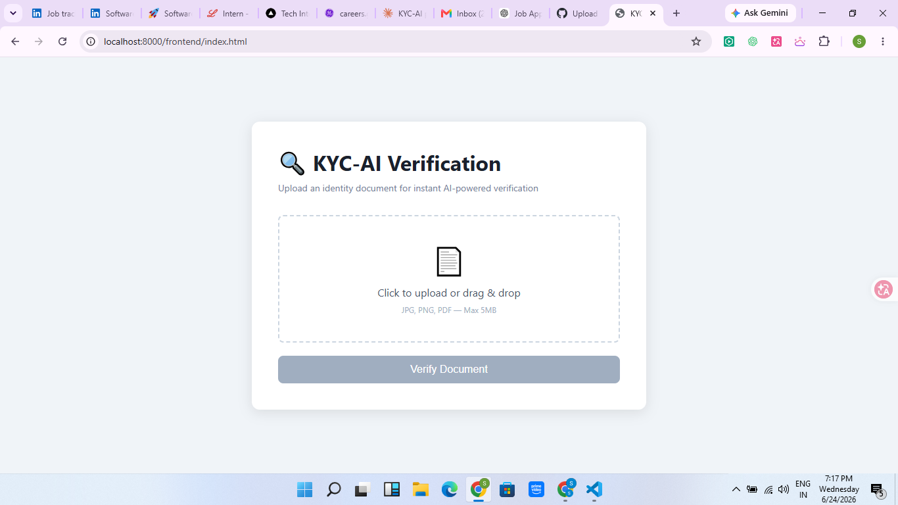
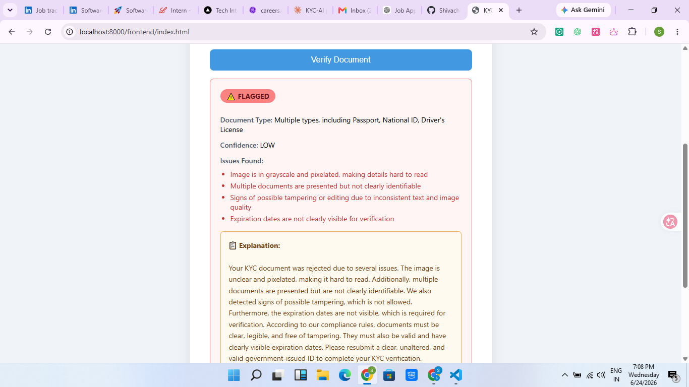
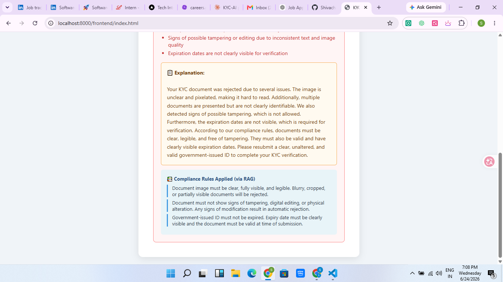

# KYC-AI Fullstack

AI-powered document verification platform leveraging Groq Vision, ChromaDB, and Retrieval-Augmented Generation (RAG) to provide explainable compliance decisions.

## Overview

KYC-AI is a full-stack document verification system that automates identity document analysis using AI. The platform evaluates uploaded documents, identifies compliance issues, retrieves relevant verification policies using a RAG pipeline, and generates clear explanations for users.

The project was built to explore AI-assisted verification workflows, explainable AI systems, and Retrieval-Augmented Generation in compliance-focused applications.

---

## Features

- Document Upload & Verification
- AI-Powered Document Analysis
- Compliance Rule Retrieval using ChromaDB
- Retrieval-Augmented Generation (RAG)
- Explainable Verification Decisions
- Groq Vision Integration
- FastAPI REST Backend
- Interactive Frontend Interface

---

## Demo Screenshots

### Upload Interface



### Verification Result



### RAG-Based Explanation



---

## Tech Stack

### Backend

- FastAPI
- Python
- ChromaDB
- Groq API
- REST APIs

### Frontend

- HTML
- CSS
- JavaScript

### AI Components

- Groq Vision Model
- ChromaDB Vector Database
- Retrieval-Augmented Generation (RAG)
- Prompt Engineering

---

## Architecture

```text
User Upload
      ↓
FastAPI Backend
      ↓
Groq Vision Analysis
      ↓
Issue Detection
      ↓
ChromaDB Retrieval
      ↓
Compliance Rules
      ↓
Explanation Generation
```

---

## Project Structure

```text
KYC-AI-Fullstack/
│
├── frontend/
│   └── index.html
│
├── assets/
│   ├── upload-screen.png
│   ├── verification-result.png
│   └── rag-explanation.png
│
├── compliance_rules.py
├── rag_service.py
├── llm_service.py
├── database.py
├── main.py
├── requirements.txt
└── README.md
```

---

## How It Works

1. User uploads an identity document.
2. FastAPI receives and processes the document.
3. Groq Vision analyzes the document and identifies potential issues.
4. If issues are detected, the RAG pipeline retrieves relevant compliance rules from ChromaDB.
5. Retrieved rules are supplied to the language model.
6. The system generates a human-readable explanation grounded in compliance policies.
7. Results are displayed through the frontend interface.

---

## Challenges & Learnings

- Implemented a Retrieval-Augmented Generation (RAG) pipeline using ChromaDB.
- Integrated Groq Vision for document analysis and verification.
- Built explainable AI workflows instead of simple pass/fail responses.
- Resolved Python version and dependency compatibility issues.
- Improved debugging skills through API integration and deployment troubleshooting.
- Learned how to use AI coding assistants such as Claude, Cursor, and GitHub Copilot effectively while validating generated code independently.

---

## Future Improvements

- OCR-based data extraction
- User authentication and dashboards
- Multi-document verification workflows
- Confidence score visualizations
- Deployment on cloud infrastructure
- Advanced fraud and tampering detection

---

## Author

**Shiva Chandan Patel**

- GitHub: https://github.com/Shivachandan32
- LinkedIn: https://linkedin.com/in/shivachandanpatel
